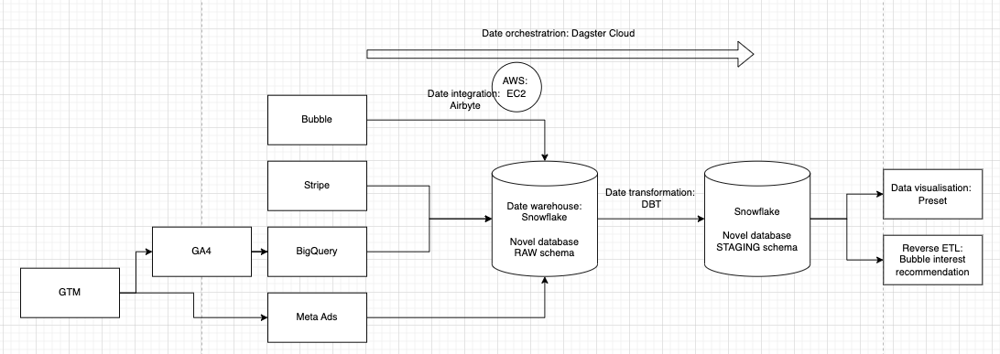
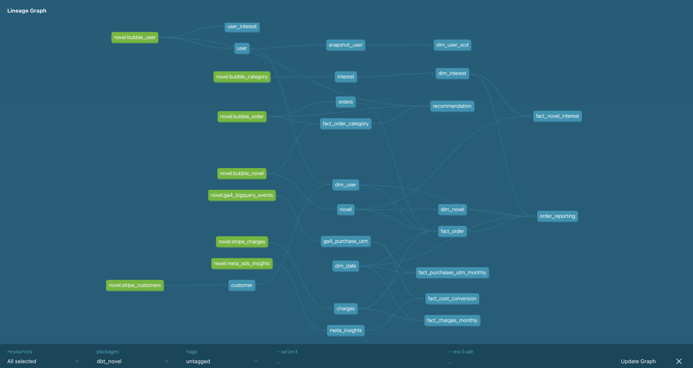

This captstone project uses the following data engineering tools: 
- Data integration: Airbyte runnin go a AWS EC2 instance
- Data transformations: DBT 
- Data orchestration: Dagster Cloud
- Data warehouse: Snowflake
- Github to push various versions

This is an overview of the entire project: 

First of all, data is extracted from various live dataset sources using Airbyte:
- BigQuery which contains Google Analytics 4 which is generated via Google Tag Manager using the dataLayer (Javascript) (sync mode: incremental append based on event_timestamp)
- Bubble using a custom build connector in Airbyte (you can test this with Postman) (sync mode: full refresh overwrite)
- Stripe (sync mode: incremental append + deduped based on cursor field updated and primary field id)
- Facebook marketing / ad data (sync mode: incremental append + deduped based on cursor field date_start and primary key date_start, account_id and ad_id)

And this data is send over to a Snowflake data warehouse.

Users can connect with Airbyte using local host or an EC2 instance in the env file. 

You can test the data pipelines using the [web app](https://test-project-novel.bubbleapps.io/)

This is an overview of the ERD diagram: 

This project uses various data transformation techniques including:
- Aggregation functions: sum, count, rank
- Grouping
- Window function
- Casting
- Filtering
- Sorting
- Joins
- Renaming
- Union

This project also contains data modeling techniques with various:
- Fact tables 
- Dimension tables

Here you can find an overview of the star schema: 

The project also contains Slowly Changing Dimensions, here is the SQL code making use of Snapshot tables: 

This project also contains data quality tests using DBT generic tests like:
- not null
- unique
- accepted values

This is an overview of the DBT docs lineage 

All of this is orchestrated via Dagster Cloud, here is an overview of the global lineage:

In the Dagster code we use: 
- a job to trigger airbyte connections on the EC2 instance. This is scheduled based on a cron schedule. 
- auto-materialize on the models generated via DBT (have to activate this within Dagster Cloud settings)

All of this data is used for two purposes
1. Preset to visualise for insights. Here are some Charts in the Novel dashboard: 

These are based on the tables: 
- order_reporting (one big table)
- fact_cost_conversion
- fact_purchases_utm_monthly
- recommendation

2. Reverse ETL with a recommonded interest. Users can order a surprise novel and based on the user interest, the recommendation.sql table gives the interest table with the most novel orders. Note that the reverse ETL pipeline isn't finished yet between the DBT generated model and Bubble. 

